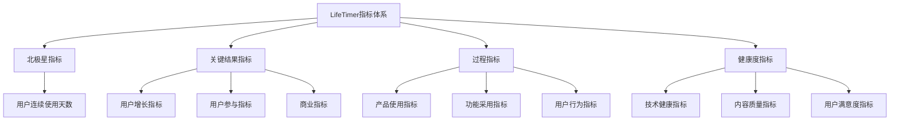
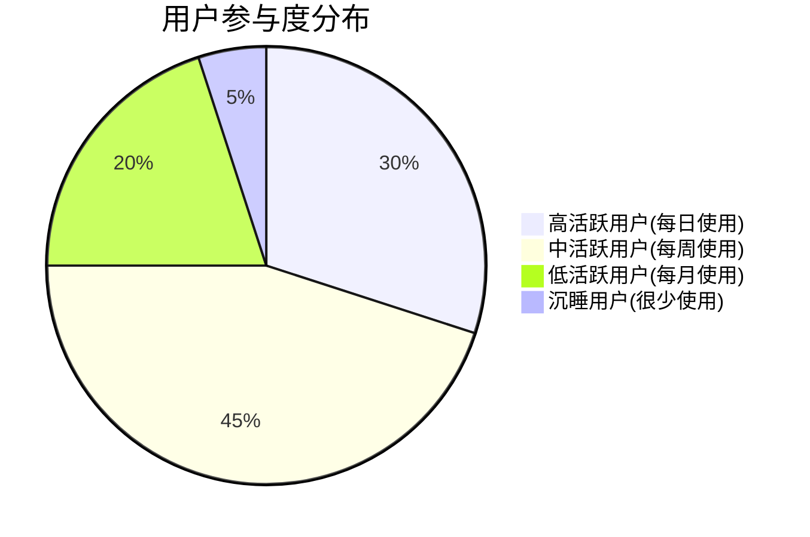
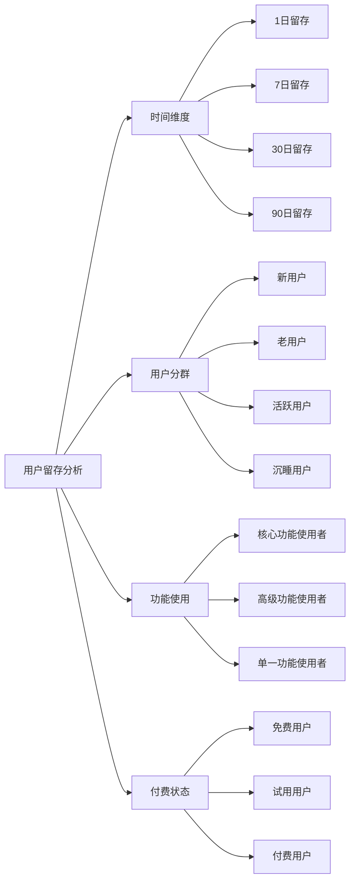
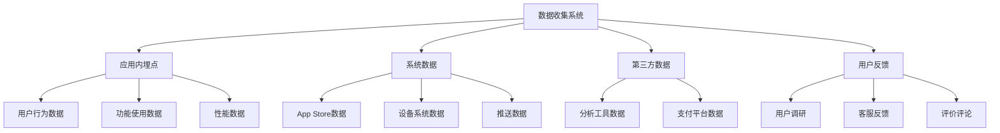
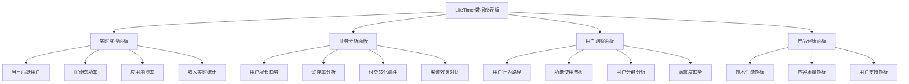
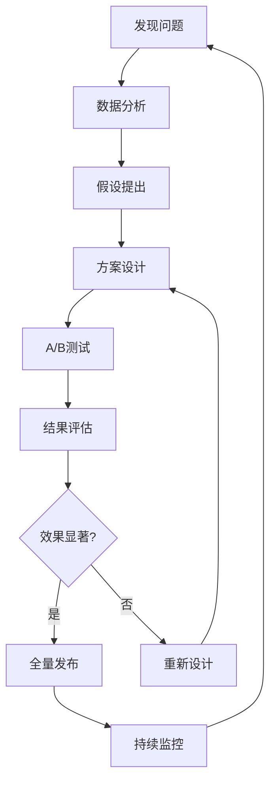

# LifeTimer 产品评估指标框架 (Metrics Framework)

## 1. 指标框架概述

### 1.1 指标体系目标
LifeTimer的指标框架旨在全面衡量产品的成功程度，从用户价值、商业价值和产品健康度三个维度建立科学的评估体系。通过数据驱动的方式指导产品决策，确保产品朝着正确的方向发展。

### 1.2 指标设计原则
- **用户中心**: 优先关注用户价值和体验指标
- **商业导向**: 平衡用户价值与商业目标
- **可操作性**: 指标能够指导具体的产品优化行动
- **可衡量性**: 所有指标都有明确的定义和计算方法
- **前瞻性**: 既关注当前表现，也预测未来趋势

### 1.3 指标分层结构


## 2. 北极星指标定义

### 2.1 北极星指标选择
**指标名称**: 用户连续使用天数 (Consecutive Usage Days)
**指标定义**: 用户连续使用LifeTimer设置并成功被唤醒的天数

### 2.2 选择依据
1. **直接反映产品价值**: 连续使用体现了产品帮助用户养成良好作息习惯的核心价值
2. **与商业目标高度相关**: 连续使用天数与用户留存和付费意愿强相关
3. **可量化且易跟踪**: 有明确的计算方法和数据来源
4. **指导产品优化**: 能够指导我们优化产品功能和用户体验

### 2.3 北极星指标目标设定

| 时间阶段 | 目标值 | 计算方法 | 达成策略 |
|----------|--------|----------|----------|
| MVP阶段(1-3个月) | 平均7天 | 所有用户连续使用天数的平均值 | 确保基础功能稳定可靠 |
| 成长阶段(3-6个月) | 平均14天 | 活跃用户连续使用天数的平均值 | 优化用户体验，增加内容丰富度 |
| 成熟阶段(6-12个月) | 平均21天 | 付费用户连续使用天数的平均值 | 个性化功能，智能化体验 |
| 长期目标(12个月+) | 平均90天 | 忠诚用户连续使用天数的平均值 | 生态建设，社区运营 |

### 2.4 北极星指标分解

#### 2.4.1 影响因素分析
```mermaid
fishbone
    title 影响用户连续使用天数的因素
    "产品功能" --> "连续使用天数"
    "用户体验" --> "连续使用天数"
    "内容质量" --> "连续使用天数"
    "技术稳定性" --> "连续使用天数"
    
    "产品功能" --> "闹钟准确性"
    "产品功能" --> "设置便捷性"
    "产品功能" --> "功能完整性"
    
    "用户体验" --> "界面友好性"
    "用户体验" --> "操作流畅性"
    "用户体验" --> "反馈及时性"
    
    "内容质量" --> "语音质量"
    "内容质量" --> "内容丰富度"
    "内容质量" --> "内容相关性"
    
    "技术稳定性" --> "应用稳定性"
    "技术稳定性" --> "性能表现"
    "技术稳定性" --> "兼容性"
```

#### 2.4.2 关键驱动指标
| 驱动因素 | 关键指标 | 目标值 | 监控频率 |
|----------|----------|--------|----------|
| 闹钟可靠性 | 闹钟成功率 | ≥99.5% | 每日 |
| 用户体验 | 应用崩溃率 | ≤0.1% | 每日 |
| 内容质量 | 语音播放完成率 | ≥85% | 每周 |
| 用户参与 | 日活跃率 | ≥60% | 每日 |

## 3. HEART指标体系详述

### 3.1 HEART框架概述
HEART是Google提出的用户体验指标框架，包含Happiness(快乐度)、Engagement(参与度)、Adoption(采用度)、Retention(留存度)、Task Success(任务成功率)五个维度。

### 3.2 Happiness (快乐度) - 用户满意度

#### 3.2.1 核心指标
| 指标名称 | 定义 | 计算方法 | 目标值 | 数据来源 |
|----------|------|----------|--------|----------|
| App Store评分 | 用户在应用商店的评分 | 加权平均评分 | ≥4.5星 | App Store Connect |
| 用户满意度调研 | 定期用户满意度调查结果 | NPS得分 | ≥50 | 应用内调研 |
| 正面反馈比例 | 正面反馈占总反馈的比例 | 正面反馈数/总反馈数 | ≥80% | 反馈系统 |
| 推荐意愿 | 用户推荐产品的意愿程度 | 推荐意愿评分 | ≥4.0/5.0 | 用户调研 |

#### 3.2.2 监控方法
- **App Store评分**: 每日监控，重点关注评分趋势和评论内容
- **用户调研**: 每月进行一次满意度调研，样本量≥100
- **反馈分析**: 每周分析用户反馈，分类统计情感倾向

### 3.3 Engagement (参与度) - 用户活跃度

#### 3.3.1 核心指标
| 指标名称 | 定义 | 计算方法 | 目标值 | 监控频率 |
|----------|------|----------|--------|----------|
| 日活跃用户数(DAU) | 每日使用应用的用户数 | 当日启动应用的独立用户数 | 500+ | 每日 |
| 月活跃用户数(MAU) | 每月使用应用的用户数 | 当月启动应用的独立用户数 | 2000+ | 每月 |
| 会话时长 | 用户单次使用应用的时长 | 从启动到退出的时间 | 2-5分钟 | 每日 |
| 会话频率 | 用户每日使用应用的次数 | 用户每日启动应用的次数 | 1.5次/日 | 每日 |
| 功能使用深度 | 用户使用功能的丰富程度 | 使用功能数/总功能数 | ≥60% | 每周 |

#### 3.3.2 参与度分层分析


### 3.4 Adoption (采用度) - 功能采用率

#### 3.4.1 核心指标
| 指标名称 | 定义 | 计算方法 | 目标值 | 监控频率 |
|----------|------|----------|--------|----------|
| 新用户激活率 | 新用户完成首次设置的比例 | 完成设置用户数/新注册用户数 | ≥85% | 每日 |
| 功能发现率 | 用户发现新功能的比例 | 使用新功能用户数/总用户数 | ≥60% | 每周 |
| 功能采用率 | 用户采用特定功能的比例 | 使用功能用户数/总用户数 | 因功能而异 | 每周 |
| 高级功能使用率 | 付费用户使用高级功能的比例 | 使用高级功能用户数/付费用户数 | ≥70% | 每月 |

#### 3.4.2 关键功能采用率目标
| 功能名称 | 目标采用率 | 当前采用率 | 优化策略 |
|----------|------------|------------|----------|
| 闹钟设置 | 100% | - | 核心功能，必须达到 |
| 重复模式设置 | 90% | - | 引导用户设置工作日模式 |
| 音量调节 | 70% | - | 在设置流程中提示 |
| 语音试听 | 80% | - | 设置时自动播放预览 |
| 订阅购买 | 15% | - | 优化试用体验和价值传达 |

### 3.5 Retention (留存度) - 用户留存

#### 3.5.1 核心指标
| 指标名称 | 定义 | 计算方法 | 目标值 | 监控频率 |
|----------|------|----------|--------|----------|
| 次日留存率 | 新用户第二天继续使用的比例 | D1留存用户数/新用户数 | ≥70% | 每日 |
| 7日留存率 | 新用户第7天继续使用的比例 | D7留存用户数/新用户数 | ≥40% | 每周 |
| 30日留存率 | 新用户第30天继续使用的比例 | D30留存用户数/新用户数 | ≥20% | 每月 |
| 付费用户留存率 | 付费用户的留存情况 | 付费后继续使用的用户比例 | ≥80% | 每月 |

#### 3.5.2 留存率分析维度


### 3.6 Task Success (任务成功率) - 任务完成度

#### 3.6.1 核心指标
| 指标名称 | 定义 | 计算方法 | 目标值 | 监控频率 |
|----------|------|----------|--------|----------|
| 闹钟设置成功率 | 用户成功设置闹钟的比例 | 成功设置闹钟数/尝试设置数 | ≥95% | 每日 |
| 闹钟唤醒成功率 | 闹钟成功唤醒用户的比例 | 成功唤醒次数/闹钟触发次数 | ≥90% | 每日 |
| 订阅购买成功率 | 用户成功完成订阅的比例 | 成功订阅数/尝试订阅数 | ≥80% | 每日 |
| 问题解决率 | 用户问题得到解决的比例 | 解决问题数/提交问题数 | ≥85% | 每周 |

#### 3.6.2 任务流程分析
| 关键任务 | 步骤分解 | 成功率目标 | 失败原因分析 |
|----------|----------|------------|--------------|
| 首次设置闹钟 | 1.选择时间 2.设置重复 3.保存设置 | 95% | 界面不清晰、操作复杂 |
| 语音试听 | 1.进入设置 2.点击试听 3.播放完成 | 90% | 音频加载失败、权限问题 |
| 完成订阅 | 1.查看套餐 2.选择方案 3.支付确认 | 80% | 价格犹豫、支付流程复杂 |

## 4. AARRR海盗指标详述

### 4.1 Acquisition (获客) - 用户获取

#### 4.1.1 获客渠道指标
| 渠道名称 | 核心指标 | 计算方法 | 目标值 | 成本预算 |
|----------|----------|----------|--------|----------|
| App Store自然搜索 | 自然下载量 | 通过搜索下载的用户数 | 60%占比 | 免费 |
| 社交媒体推广 | 社交转化率 | 社交渠道下载数/曝光数 | 2% | ¥5000/月 |
| 朋友推荐 | 推荐转化率 | 推荐下载数/推荐邀请数 | 15% | 推荐奖励成本 |
| 内容营销 | 内容转化率 | 内容渠道下载数/内容阅读数 | 3% | ¥3000/月 |

#### 4.1.2 获客成本分析
| 获客渠道 | 单用户获客成本(CAC) | 用户生命周期价值(LTV) | LTV/CAC比值 | 投资建议 |
|----------|---------------------|----------------------|-------------|----------|
| 自然搜索 | ¥0 | ¥50 | ∞ | 重点优化ASO |
| 社交推广 | ¥25 | ¥50 | 2.0 | 适度投入 |
| 朋友推荐 | ¥8 | ¥60 | 7.5 | 重点激励 |
| 内容营销 | ¥15 | ¥55 | 3.7 | 持续投入 |

### 4.2 Activation (激活) - 用户激活

#### 4.2.1 激活定义与指标
**激活定义**: 用户在首次使用后24小时内成功设置并使用闹钟功能

| 激活指标 | 定义 | 计算方法 | 目标值 | 优化策略 |
|----------|------|----------|--------|----------|
| 激活率 | 新用户激活的比例 | 激活用户数/新下载用户数 | ≥70% | 优化引导流程 |
| 激活时间 | 从下载到激活的平均时间 | 激活时间总和/激活用户数 | ≤10分钟 | 简化设置步骤 |
| 首次成功率 | 首次设置闹钟的成功率 | 首次成功用户数/尝试用户数 | ≥90% | 改进用户界面 |

#### 4.2.2 激活漏斗分析
```mermaid
funnel
    title 用户激活漏斗
    "下载应用" : 100
    "启动应用" : 85
    "完成引导" : 70
    "设置闹钟" : 60
    "成功唤醒" : 50
```

### 4.3 Retention (留存) - 用户留存
*详见3.5节HEART框架中的留存度指标*

### 4.4 Revenue (收入) - 收入转化

#### 4.4.1 收入指标体系
| 指标名称 | 定义 | 计算方法 | 目标值 | 监控频率 |
|----------|------|----------|--------|----------|
| 付费转化率 | 免费用户转为付费用户的比例 | 付费用户数/总用户数 | ≥15% | 每日 |
| 月度经常性收入(MRR) | 每月的订阅收入 | 月度订阅费用总和 | ¥50,000+ | 每月 |
| 年度经常性收入(ARR) | 年化的订阅收入 | MRR × 12 | ¥600,000+ | 每月 |
| 平均每用户收入(ARPU) | 每个用户的平均收入 | 总收入/总用户数 | ¥25+ | 每月 |
| 付费用户平均收入(ARPPU) | 每个付费用户的平均收入 | 总收入/付费用户数 | ¥150+ | 每月 |

#### 4.4.2 收入结构分析
| 订阅类型 | 价格 | 占比目标 | 收入贡献 | 用户特征 |
|----------|------|----------|----------|----------|
| 月度订阅 | ¥6/月 | 40% | 40% | 尝试型用户 |
| 年度订阅 | ¥58/年 | 60% | 60% | 忠诚用户 |

### 4.5 Referral (推荐) - 用户推荐

#### 4.5.1 推荐指标
| 指标名称 | 定义 | 计算方法 | 目标值 | 激励机制 |
|----------|------|----------|--------|----------|
| 推荐率 | 用户推荐他人的比例 | 发起推荐用户数/总用户数 | ≥20% | 推荐奖励 |
| 推荐转化率 | 推荐成功的比例 | 通过推荐注册数/推荐邀请数 | ≥15% | 双向奖励 |
| 病毒系数(K值) | 每个用户平均带来的新用户数 | 推荐成功数/推荐用户数 | ≥0.3 | 优化分享体验 |
| 推荐用户质量 | 推荐用户的留存和付费表现 | 推荐用户30日留存率 | ≥25% | 精准推荐 |

## 5. 功能级评估指标

### 5.1 闹钟功能指标

#### 5.1.1 核心性能指标
| 指标名称 | 定义 | 目标值 | 监控方式 |
|----------|------|--------|----------|
| 闹钟准确率 | 闹钟在设定时间准确响起的比例 | ≥99.9% | 自动监控 |
| 响应延迟 | 闹钟触发到实际响起的时间差 | ≤30秒 | 技术监控 |
| 设置成功率 | 用户成功设置闹钟的比例 | ≥95% | 用户行为分析 |
| 使用频率 | 用户平均每周使用闹钟的次数 | ≥5次/周 | 使用统计 |

#### 5.1.2 用户体验指标
| 指标名称 | 定义 | 目标值 | 评估方法 |
|----------|------|--------|----------|
| 设置便捷性 | 用户完成闹钟设置的平均时间 | ≤2分钟 | 用户行为追踪 |
| 操作错误率 | 用户在设置过程中的错误操作比例 | ≤5% | 错误日志分析 |
| 界面满意度 | 用户对闹钟界面的满意程度 | ≥4.0/5.0 | 用户调研 |

### 5.2 语音内容指标

#### 5.2.1 内容质量指标
| 指标名称 | 定义 | 目标值 | 评估方法 |
|----------|------|--------|----------|
| 播放完成率 | 用户完整听完语音的比例 | ≥85% | 播放数据分析 |
| 内容满意度 | 用户对语音内容的满意程度 | ≥4.2/5.0 | 内容评分 |
| 重复播放率 | 用户主动重复播放的比例 | ≥20% | 播放行为分析 |
| 跳过率 | 用户跳过语音播放的比例 | ≤15% | 播放数据分析 |

#### 5.2.2 内容效果指标
| 指标名称 | 定义 | 目标值 | 评估方法 |
|----------|------|--------|----------|
| 唤醒效果 | 语音成功唤醒用户的比例 | ≥90% | 用户反馈 |
| 情绪提升 | 用户听后情绪改善的程度 | ≥4.0/5.0 | 情绪调研 |
| 动力激发 | 用户感受到动力激发的程度 | ≥4.0/5.0 | 效果调研 |

### 5.3 订阅功能指标

#### 5.3.1 转化漏斗指标
| 转化阶段 | 指标名称 | 目标值 | 优化重点 |
|----------|----------|--------|----------|
| 试用开始 | 试用激活率 | ≥80% | 引导优化 |
| 试用体验 | 试用期活跃度 | ≥70% | 体验优化 |
| 付费决策 | 试用转付费率 | ≥15% | 价值传达 |
| 付费完成 | 支付成功率 | ≥95% | 支付流程 |

#### 5.3.2 订阅健康度指标
| 指标名称 | 定义 | 目标值 | 监控频率 |
|----------|------|--------|----------|
| 订阅续费率 | 订阅到期后继续续费的比例 | ≥80% | 每月 |
| 取消率 | 用户主动取消订阅的比例 | ≤20% | 每月 |
| 退款率 | 用户申请退款的比例 | ≤5% | 每月 |
| 订阅时长 | 用户平均订阅持续时间 | ≥6个月 | 每季度 |

## 6. 指标监测计划

### 6.1 数据收集架构

#### 6.1.1 数据源分类


#### 6.1.2 关键埋点事件
| 事件类型 | 事件名称 | 触发条件 | 收集参数 |
|----------|----------|----------|----------|
| 应用生命周期 | app_launch | 应用启动 | 启动时间、设备信息、版本号 |
| 用户行为 | alarm_create | 创建闹钟 | 时间、重复模式、音量 |
| 功能使用 | voice_play | 语音播放 | 语音ID、播放时长、完成状态 |
| 商业事件 | subscription_purchase | 订阅购买 | 订阅类型、价格、支付方式 |
| 性能事件 | alarm_trigger | 闹钟触发 | 设定时间、实际时间、延迟 |

### 6.2 监控频率与责任分工

#### 6.2.1 监控频率矩阵
| 指标类型 | 监控频率 | 负责人 | 报告对象 |
|----------|----------|--------|----------|
| 北极星指标 | 每日 | 产品经理 | 全团队 |
| 核心业务指标 | 每日 | 数据分析师 | 产品经理 |
| 用户体验指标 | 每周 | UX设计师 | 产品团队 |
| 技术性能指标 | 实时 | 技术负责人 | 开发团队 |
| 商业指标 | 每月 | 商业分析师 | 管理层 |

#### 6.2.2 报告制度
| 报告类型 | 频率 | 内容重点 | 参与人员 |
|----------|------|----------|----------|
| 日报 | 每日 | 核心指标、异常预警 | 核心团队 |
| 周报 | 每周 | 趋势分析、问题诊断 | 产品团队 |
| 月报 | 每月 | 目标达成、策略调整 | 全团队 |
| 季报 | 每季度 | 战略回顾、规划调整 | 管理层 |

### 6.3 数据分析工具栈

#### 6.3.1 工具选择
| 工具类型 | 工具名称 | 主要用途 | 成本预算 |
|----------|----------|----------|----------|
| 移动分析 | Firebase Analytics | 用户行为分析 | 免费 |
| 应用性能 | Firebase Crashlytics | 崩溃监控 | 免费 |
| 商业智能 | App Store Connect | 下载和收入数据 | 免费 |
| 用户反馈 | 自建系统 | 反馈收集分析 | 开发成本 |
| 数据可视化 | Tableau/自建 | 报表制作 | ¥500/月 |

#### 6.3.2 数据仪表板设计


### 6.4 异常监控与预警机制

#### 6.4.1 预警阈值设定
| 指标名称 | 正常范围 | 预警阈值 | 紧急阈值 | 处理时限 |
|----------|----------|----------|----------|----------|
| 应用崩溃率 | ≤0.1% | >0.2% | >0.5% | 2小时 |
| 闹钟成功率 | ≥99.5% | <99% | <95% | 1小时 |
| 日活跃用户 | 正常波动±20% | 下降>30% | 下降>50% | 4小时 |
| 付费转化率 | 正常波动±10% | 下降>20% | 下降>40% | 24小时 |

#### 6.4.2 应急响应流程
1. **自动监控**: 系统自动监控关键指标
2. **异常检测**: 超过阈值自动触发预警
3. **通知机制**: 立即通知相关负责人
4. **快速响应**: 按时限要求进行问题排查
5. **解决跟踪**: 记录问题和解决过程
6. **复盘改进**: 定期复盘，优化监控机制

## 7. 指标优化策略

### 7.1 数据驱动的产品优化

#### 7.1.1 A/B测试框架
| 测试类型 | 测试目标 | 关键指标 | 测试周期 |
|----------|----------|----------|----------|
| 界面优化 | 提升用户体验 | 任务完成率、用户满意度 | 2周 |
| 功能改进 | 提升功能采用率 | 功能使用率、留存率 | 4周 |
| 内容优化 | 提升内容效果 | 播放完成率、用户评分 | 3周 |
| 商业优化 | 提升付费转化 | 转化率、ARPU | 6周 |

#### 7.1.2 优化决策流程


### 7.2 指标改进路线图

#### 7.2.1 短期优化目标(1-3个月)
| 指标类别 | 当前值 | 目标值 | 主要策略 |
|----------|--------|--------|----------|
| 用户激活率 | 60% | 75% | 优化引导流程 |
| 7日留存率 | 30% | 45% | 改进用户体验 |
| 闹钟成功率 | 98% | 99.5% | 技术优化 |
| 付费转化率 | 8% | 12% | 价值传达优化 |

#### 7.2.2 中期优化目标(3-6个月)
| 指标类别 | 目标值 | 主要策略 |
|----------|--------|----------|
| 30日留存率 | 25% | 个性化功能 |
| 用户满意度 | 4.3/5.0 | 内容质量提升 |
| 月活跃用户 | 2000+ | 功能丰富化 |
| 推荐转化率 | 18% | 社交功能 |

#### 7.2.3 长期优化目标(6-12个月)
| 指标类别 | 目标值 | 主要策略 |
|----------|--------|----------|
| 连续使用天数 | 30天 | 智能化体验 |
| 用户生命周期价值 | ¥80 | 生态建设 |
| 市场份额 | 行业前三 | 品牌建设 |

### 7.3 竞争对手基准分析

#### 7.3.1 关键指标对比
| 指标名称 | LifeTimer目标 | 竞品A | 竞品B | 行业平均 |
|----------|---------------|-------|-------|----------|
| App Store评分 | 4.5+ | 4.2 | 4.0 | 3.8 |
| 7日留存率 | 45% | 35% | 40% | 30% |
| 付费转化率 | 15% | 12% | 8% | 10% |
| 用户满意度 | 4.3/5.0 | 4.0/5.0 | 3.8/5.0 | 3.5/5.0 |

#### 7.3.2 差异化优势指标
- **内容质量**: 语音播放完成率领先行业20%
- **用户粘性**: 连续使用天数超过竞品50%
- **付费价值**: 付费用户ARPU高于行业平均30%

---

**文档状态**: 已完成
**维护责任**: 产品经理 + 数据分析师
**更新频率**: 每月更新指标目标，每季度更新框架结构
**相关文档**: PRD.md, Roadmap.md, User_Story_Map.md