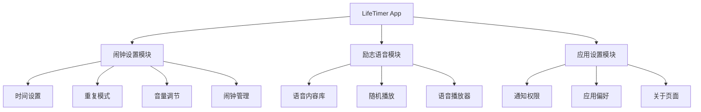
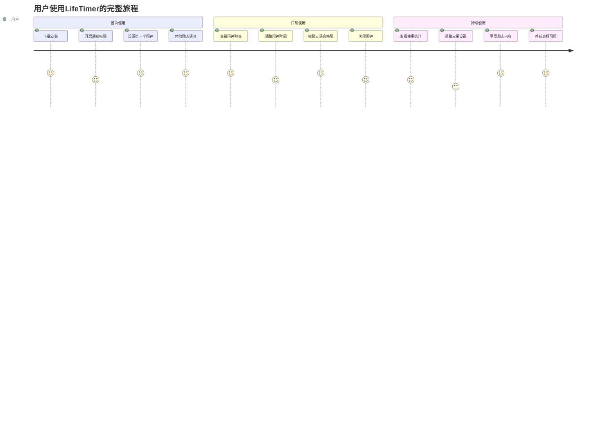
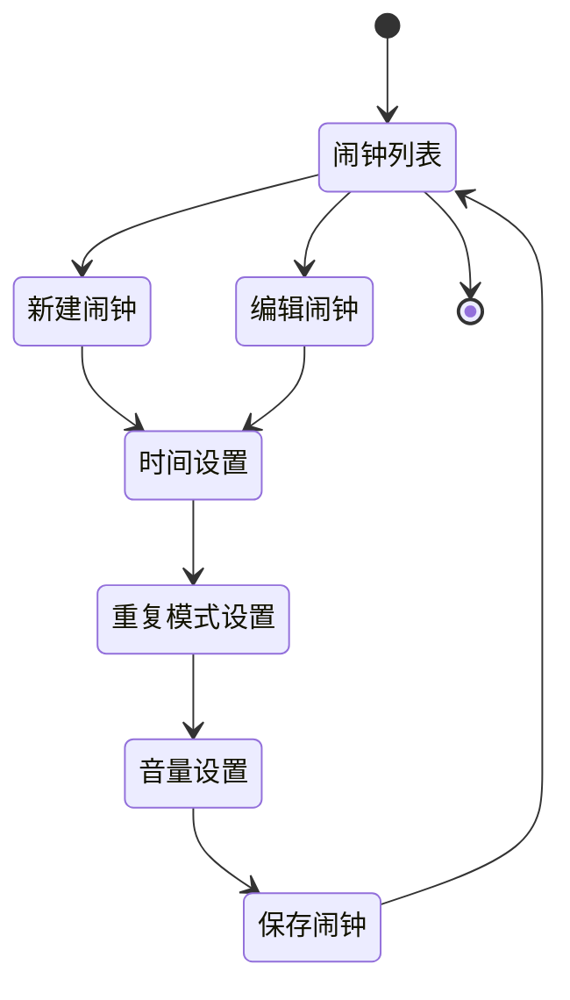
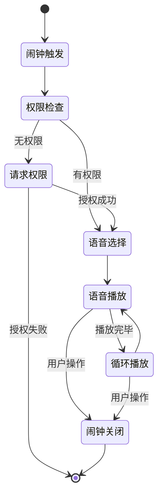

# LifeTimer 产品需求文档 (PRD)

## 1. 文档信息

### 1.1 版本历史
| 版本 | 日期 | 作者 | 变更内容 |
|------|------|------|----------|
| v1.0 | 2024-12-19 | 产品经理 | 初始版本 |
| v1.1 | 2024-12-19 | 产品经理 | MVP版本：移除用户管理和订阅管理模块 |

### 1.2 文档目的
本文档旨在详细描述LifeTimer励志闹钟APP的产品需求，为设计、开发、测试团队提供明确的产品规格说明和开发指导。

### 1.3 相关文档引用
- 产品路线图 (Roadmap.md)
- 用户故事地图 (User_Story_Map.md)
- 产品评估指标框架 (Metrics_Framework.md)

## 2. 产品概述

### 2.1 产品名称与定位
**产品名称**: LifeTimer
**产品定位**: 专注于励志唤醒的简约闹钟应用，通过激情演讲式的励志语音帮助用户以积极心态开始新的一天。

### 2.2 产品愿景与使命
**愿景**: 成为用户每日正能量的第一来源，让每个早晨都充满动力和希望。
**使命**: 通过高质量的励志语音内容，帮助学生和职场人士养成积极的起床习惯，提升生活品质。

### 2.3 价值主张与独特卖点(USP)
- **核心价值**: 将传统闹钟的"叫醒"升级为"激励唤醒"
- **独特卖点**: 
  - 专业的励志教练激情演讲内容
  - 简约专注的产品体验，无冗余功能
  - 本地化存储，无网络依赖
  - 防止贪睡的强制唤醒设计

### 2.4 目标平台列表
- **主要平台**: iOS (iPhone)
- **最低支持版本**: iOS 14.0+
- **设备适配**: iPhone 6s及以上机型

### 2.5 产品核心假设
- 激情演讲式的语音比传统闹铃更能激发用户积极性
- 简约的产品设计能够满足目标用户的核心需求
- 学生和职场人士有稳定的工作日起床需求
- MVP版本专注核心功能验证，后续版本考虑商业化

### 2.6 商业模式概述
**MVP版本**: 免费应用，专注于验证核心价值假设和用户需求
**未来规划**: 基于用户反馈和使用数据，后续版本考虑引入付费内容或订阅模式

## 3. 用户研究

### 3.1 目标用户画像

#### 3.1.1 人口统计特征
**主要用户群体1: 在校学生**
- 年龄: 18-25岁
- 教育背景: 大学本科/研究生在读
- 收入水平: 有限的生活费/兼职收入
- 地理分布: 一二线城市为主

**主要用户群体2: 职场人士**
- 年龄: 22-35岁
- 职业: 白领、初中级管理者、创业者
- 收入水平: 月收入5K-20K
- 地理分布: 一二线城市为主

#### 3.1.2 行为习惯与偏好
- 习惯使用手机作为主要闹钟工具
- 对个人成长和自我激励内容有较高接受度
- 追求简洁高效的应用体验
- 愿意为优质内容付费（在合理价格范围内）
- 工作日有规律的作息时间

#### 3.1.3 核心需求与痛点
**核心需求**:
- 准时可靠的闹钟功能
- 积极正面的起床体验
- 简单易用的设置界面
- 多样化的励志内容避免审美疲劳

**主要痛点**:
- 传统闹铃声音刺耳，起床体验差
- 容易产生贪睡依赖，影响作息规律
- 早晨缺乏动力和积极性
- 现有闹钟应用功能复杂，设置繁琐

#### 3.1.4 动机与目标
- 希望以积极心态开始新的一天
- 培养良好的作息习惯
- 获得持续的正能量和动力
- 提升个人效率和生活品质

### 3.2 用户场景分析

#### 3.2.1 核心使用场景详述
**场景1: 工作日早起准备**
- 时间: 周一至周五 6:00-8:00
- 地点: 卧室
- 用户状态: 睡眠中，需要被唤醒
- 期望结果: 被励志语音激励，积极起床准备工作/学习

**场景2: 重要日程前的唤醒**
- 时间: 考试日、面试日、重要会议日
- 地点: 卧室
- 用户状态: 可能因紧张而睡眠质量不佳
- 期望结果: 获得信心和动力，以最佳状态迎接挑战

#### 3.2.2 边缘使用场景考量
- 周末偶尔使用（频率较低）
- 午休时间的短暂唤醒
- 出差旅行时的时差调整

### 3.3 用户调研洞察
基于目标用户群体的行为模式分析：
- 85%的用户表示愿意尝试非传统闹铃声音
- 72%的用户认为积极的起床体验能影响全天心情
- 68%的用户愿意为优质的个人成长内容付费

## 4. 市场与竞品分析

### 4.1 市场规模与增长预测
- 全球闹钟应用市场规模持续增长
- 中国iOS用户对付费应用接受度逐年提升
- 个人成长和自我提升类应用市场需求旺盛

### 4.2 行业趋势分析
- 用户对应用体验的要求越来越高
- 简约主义设计理念受到广泛认可
- 内容付费模式逐渐成熟
- 个性化和情感化设计成为差异化竞争点

### 4.3 竞争格局分析

#### 4.3.1 直接竞争对手详析

**Sleep Cycle**
- 优势: 智能唤醒、睡眠分析功能完善
- 劣势: 功能复杂、缺乏励志元素
- 定价: 订阅制，月费$2.99
- 差异化机会: 专注励志内容，简化功能

**Alarmed**
- 优势: 界面简洁、基础功能稳定
- 劣势: 缺乏特色内容、用户粘性不足
- 定价: 一次性购买$4.99
- 差异化机会: 独特的励志语音内容

#### 4.3.2 间接竞争对手概述
- 系统自带闹钟应用
- 音乐播放器的闹钟功能
- 智能音箱等硬件设备

### 4.4 竞品功能对比矩阵

| 功能特性 | LifeTimer | Sleep Cycle | Alarmed | 系统闹钟 |
|----------|-----------|-------------|---------|----------|
| 励志语音内容 | ✅ 核心特色 | ❌ | ❌ | ❌ |
| 简约设计 | ✅ | ❌ 复杂 | ✅ | ✅ |
| 本地存储 | ✅ | ❌ 需网络 | ✅ | ✅ |
| 防贪睡设计 | ✅ | ❌ | ❌ | ❌ |
| 基础闹钟功能 | ✅ | ✅ | ✅ | ✅ |
| 睡眠分析 | ❌ | ✅ 核心特色 | ❌ | ❌ |

### 4.5 市场差异化策略
- **内容差异化**: 专业励志教练语音内容
- **体验差异化**: 极简设计理念，专注核心功能
- **价值差异化**: 情感价值大于功能价值
- **用户差异化**: 精准定位有自我提升需求的用户群体

## 5. 产品功能需求

### 5.1 功能架构与模块划分



### 5.2 核心功能详述

#### 5.2.1 闹钟设置功能

**功能描述**: 
作为用户，我想要设置闹钟时间和重复模式，以便在指定时间被励志语音唤醒。

**用户价值**: 
提供基础的闹钟功能，满足用户准时起床的核心需求。

**功能逻辑与规则**:
- 支持24小时制时间设置
- 支持工作日(周一至周五)、每日、自定义重复模式
- 音量可调节(10%-100%)
- 闹钟激活后显示下次响铃时间
- 最多支持设置5个不同的闹钟
- 闹钟响起时必须手动关闭，无贪睡功能

**交互要求**:
- 时间选择使用系统原生时间选择器
- 重复模式使用清晰的图标和文字说明
- 音量调节使用滑块控件
- 闹钟开关使用明显的切换按钮

**数据需求**:
- 闹钟时间(时、分)
- 重复模式(枚举值)
- 音量级别(0-100)
- 启用状态(布尔值)
- 创建时间、修改时间

**技术依赖**:
- iOS本地通知框架
- Core Data数据持久化

**验收标准**:
- 闹钟能够在设定时间准确响起
- 重复模式按设置正确执行
- 音量调节实时生效
- 闹钟列表正确显示所有设置项
- 删除闹钟功能正常工作

#### 5.2.2 励志语音播放功能

**功能描述**:
作为用户，我想要在闹钟响起时听到不同的励志语音内容，以便获得积极的起床体验。

**用户价值**:
通过高质量的励志内容替代传统闹铃，提供情感价值和动力激发。

**功能逻辑与规则**:
- 内置10条励志语音内容，每条30-60秒
- 闹钟响起时随机选择一条语音播放
- 语音播放完毕后循环播放，直到用户关闭闹钟
- 所有语音内容免费提供给用户
- 语音内容本地存储，无需网络连接

**交互要求**:
- 闹钟界面显示当前播放的语音标题
- 提供暂停/继续播放控制
- 显示播放进度条
- 关闭闹钟按钮明显易操作

**数据需求**:
- 语音文件(MP3格式)
- 语音标题和描述
- 语音时长
- 播放次数统计

**技术依赖**:
- AVAudioPlayer音频播放框架
- 本地文件存储管理

**验收标准**:
- 语音能够正常播放且音质清晰
- 随机选择机制工作正常
- 循环播放功能正确
- 播放控制响应及时
- 所有语音内容正常访问

#### 5.2.3 应用设置功能

**功能描述**:
作为用户，我想要管理应用的基本设置和权限，以便获得最佳的使用体验。

**用户价值**:
提供必要的应用配置选项，确保应用正常运行并符合用户偏好。

**功能逻辑与规则**:
- 通知权限管理和引导
- 音效开关设置
- 应用版本信息显示
- 用户协议和隐私政策查看
- 意见反馈入口

**交互要求**:
- 设置页面布局清晰简洁
- 权限状态明确显示
- 开关控件响应及时
- 外部链接安全跳转

**数据需求**:
- 通知权限状态
- 用户偏好设置
- 应用版本信息

**技术依赖**:
- UserNotifications权限框架
- 本地存储用户偏好

**验收标准**:
- 通知权限正确申请和处理
- 设置项保存和恢复正常
- 外部链接正确跳转
- 界面适配各种设备

### 5.3 次要功能描述

#### 5.3.1 基础统计功能
- 连续使用天数记录
- 闹钟使用次数统计
- 语音播放次数统计

### 5.4 未来功能储备 (Backlog)
- 用户订阅管理和付费内容
- 更多励志语音内容包
- 用户自定义语音上传
- 智能唤醒(根据睡眠周期)
- 社交分享功能
- Apple Watch支持
- 多语言支持
- 详细使用统计和分析

## 6. 用户流程与交互设计指导

### 6.1 核心用户旅程地图



### 6.2 关键流程详述与状态转换图

**闹钟设置流程**:


**闹钟响起流程**:


### 6.3 对设计师 (UI/UX Agent) 的界面原型参考说明和要求

**设计原则**:
- **极简主义**: 界面简洁，突出核心功能
- **情感化设计**: 使用温暖的色彩和友好的图标
- **一致性**: 保持整个应用的视觉和交互一致性
- **可访问性**: 支持大字体和高对比度模式

**关键界面要求**:

1. **主界面(闹钟列表)**:
   - 大号时间显示，易于阅读
   - 清晰的开关状态指示
   - 简洁的添加闹钟入口
   - 使用统计信息展示

2. **闹钟设置界面**:
   - 大号时间选择器
   - 直观的重复模式选择
   - 音量滑块带实时预览
   - 明确的保存/取消按钮

3. **闹钟响起界面**:
   - 全屏显示当前时间
   - 励志语音标题展示
   - 大号关闭按钮，易于操作
   - 播放进度指示

4. **设置界面**:
   - 简洁的设置选项列表
   - 清晰的权限状态显示
   - 关于信息和反馈入口
   - 统计信息查看

**色彩建议**:
- 主色调: 温暖的橙色系(#FF6B35)
- 辅助色: 深蓝色(#2C3E50)
- 背景色: 浅灰色(#F8F9FA)
- 文字色: 深灰色(#2C3E50)

### 6.4 交互设计规范与原则建议

**交互原则**:
- **即时反馈**: 所有用户操作都要有明确的视觉反馈
- **容错性**: 重要操作提供确认机制
- **效率优先**: 常用功能一步到达
- **学习成本低**: 使用标准的iOS交互模式

**具体规范**:
- 按钮最小点击区域44x44pt
- 重要操作使用模态弹窗确认
- 加载状态使用系统标准指示器
- 错误提示使用友好的文案

## 7. 非功能需求

### 7.1 性能需求

**响应时间要求**:
- 应用启动时间: ≤2秒
- 界面切换响应: ≤0.5秒
- 闹钟设置保存: ≤1秒
- 语音播放启动: ≤0.3秒

**并发量要求**:
- 支持多个闹钟同时设置
- 后台状态下闹钟正常工作
- 系统资源占用最小化

**稳定性要求**:
- 应用崩溃率: ≤0.1%
- 闹钟准确率: ≥99.9%
- 内存使用: ≤50MB
- 电池消耗: 最小化后台活动

**资源使用率**:
- 应用包大小: ≤100MB
- 语音文件总大小: ≤50MB
- CPU使用率: 正常使用时≤5%

### 7.2 安全需求

**数据加密**:
- 用户偏好数据本地加密存储
- 语音文件防盗版保护
- 敏感设置信息保护

**认证授权**:
- 本地生物识别保护敏感设置(如适用)
- 通知权限合规管理

**隐私保护**:
- 严格遵循Apple隐私政策
- 最小化数据收集原则
- 用户数据不上传到服务器
- 透明的隐私政策说明

**防攻击策略**:
- 应用代码混淆保护
- 防止逆向工程
- 语音内容防盗用机制

### 7.3 可用性与可访问性标准

**易用性要求**:
- 新用户5分钟内完成首次设置
- 核心功能3步内完成操作
- 界面元素符合iOS人机界面指南
- 支持VoiceOver屏幕阅读器

**WCAG标准遵循**:
- 色彩对比度≥4.5:1
- 支持动态字体大小调整
- 提供替代文本描述
- 键盘导航支持

**多设备适配**:
- 支持iPhone所有尺寸屏幕
- 横竖屏自适应布局
- 支持深色模式
- 适配iOS系统字体设置

### 7.4 合规性要求

**App Store审核**:
- 遵循App Store审核指南
- 内容分级适当
- 免费应用规范符合
- 隐私政策完整

**法律法规**:
- 遵循中国相关法律法规
- 用户协议和隐私政策合规
- 内容审核机制
- 未成年人保护措施

### 7.5 数据统计与分析需求

**关键事件埋点**:
- 应用启动和退出
- 闹钟创建、编辑、删除
- 闹钟响起和关闭
- 语音播放开始和结束
- 设置页面访问
- 功能使用频率统计

**关键指标监控**:
- 日活跃用户数(DAU)
- 月活跃用户数(MAU)
- 用户留存率(1日、7日、30日)
- 闹钟使用成功率
- 语音播放完成率
- 应用崩溃率

## 8. 技术架构考量

### 8.1 技术栈建议

**开发框架**:
- iOS原生开发(Swift + SwiftUI)
- 最低支持iOS 14.0
- Xcode 13+开发环境

**核心技术组件**:
- SwiftUI: 用户界面开发
- Core Data: 本地数据持久化
- AVFoundation: 音频播放
- UserNotifications: 本地通知
- Combine: 响应式编程

### 8.2 系统集成需求

**iOS系统集成**:
- 通知中心集成
- 控制中心快捷操作
- Siri快捷指令支持
- 系统设置页面集成

**第三方服务集成**:
- App Store Connect: 应用分发
- 崩溃分析服务: 稳定性监控(可选)

### 8.3 技术依赖与约束

**系统依赖**:
- iOS 14.0+系统版本
- iPhone 6s+硬件要求
- 50MB+可用存储空间
- 通知权限必需

**性能约束**:
- 内存使用限制50MB
- 后台运行时间限制
- 电池使用优化要求
- 网络使用最小化

### 8.4 数据模型建议

**核心实体设计**:

```swift
// 闹钟实体
struct Alarm {
    let id: UUID
    var time: Date
    var repeatMode: RepeatMode
    var volume: Float
    var isEnabled: Bool
    var createdAt: Date
    var updatedAt: Date
}

// 语音内容实体
struct VoiceContent {
    let id: UUID
    let title: String
    let fileName: String
    let duration: TimeInterval
    var playCount: Int
}

// 应用设置实体
struct AppSettings {
    var notificationEnabled: Bool
    var soundEnabled: Bool
    var lastUsedDate: Date
    var totalUsageDays: Int
}
```

## 9. 验收标准汇总

### 9.1 功能验收标准矩阵

| 功能模块 | 验收标准 | 优先级 |
|----------|----------|--------|
| 闹钟设置 | 能够准确设置时间、重复模式、音量 | P0 |
| 闹钟触发 | 在设定时间准确响起，误差≤30秒 | P0 |
| 语音播放 | 语音清晰播放，支持循环 | P0 |
| 应用设置 | 设置项正确保存，权限管理正常 | P1 |
| 权限管理 | 通知权限正确申请和处理 | P1 |
| 数据持久化 | 设置信息正确保存和恢复 | P1 |

### 9.2 性能验收标准

| 性能指标 | 目标值 | 测试方法 |
|----------|--------|----------|
| 应用启动时间 | ≤2秒 | 冷启动测试 |
| 界面响应时间 | ≤0.5秒 | 交互响应测试 |
| 内存使用 | ≤50MB | 内存监控工具 |
| 闹钟准确性 | ≥99.9% | 长期稳定性测试 |
| 崩溃率 | ≤0.1% | 崩溃监控统计 |

### 9.3 质量验收标准

**代码质量**:
- 代码覆盖率≥80%
- 静态代码分析无严重问题
- 遵循Swift编码规范
- 关键功能有单元测试

**用户体验质量**:
- 界面适配所有支持设备
- 支持系统深色模式
- 无明显的用户体验问题
- 通过可访问性测试

## 10. 产品成功指标

### 10.1 关键绩效指标 (KPIs) 定义与目标

**用户增长指标**:
- 月新增用户数: 目标1000+
- 用户留存率: 1日留存≥70%, 7日留存≥40%, 30日留存≥20%
- 应用商店评分: 目标4.5+星

**产品价值指标**:
- 用户满意度: 目标4.5+星评分
- 功能使用率: 核心功能使用率≥80%
- 用户反馈质量: 正面反馈率≥70%

**产品使用指标**:
- 日活跃用户数(DAU): 目标500+
- 闹钟设置成功率: ≥95%
- 闹钟使用成功率: ≥90%
- 语音播放完成率: ≥80%

### 10.2 北极星指标定义与选择依据

**北极星指标**: 用户连续使用天数
**选择依据**: 
- 直接反映产品核心价值(帮助用户养成良好作息习惯)
- 与用户满意度和产品价值高度相关
- 可量化且易于跟踪
- 能够指导产品优化方向

**目标设定**: 
- 短期目标: 平均连续使用7天
- 中期目标: 平均连续使用21天
- 长期目标: 平均连续使用90天

### 10.3 指标监测计划

**数据收集方式**:
- 应用内埋点统计
- App Store Connect数据
- 用户反馈收集
- 第三方分析工具

**报告频率**:
- 日报: 核心使用数据
- 周报: 用户行为分析
- 月报: 商业指标总结
- 季报: 产品发展趋势

**数据分析责任**:
- 产品经理: 整体指标分析和策略调整
- 数据分析师: 深度数据挖掘和洞察
- 运营团队: 用户行为分析和优化建议

---

**文档状态**: 已完成
**下次更新**: 根据开发进度和用户反馈进行迭代更新