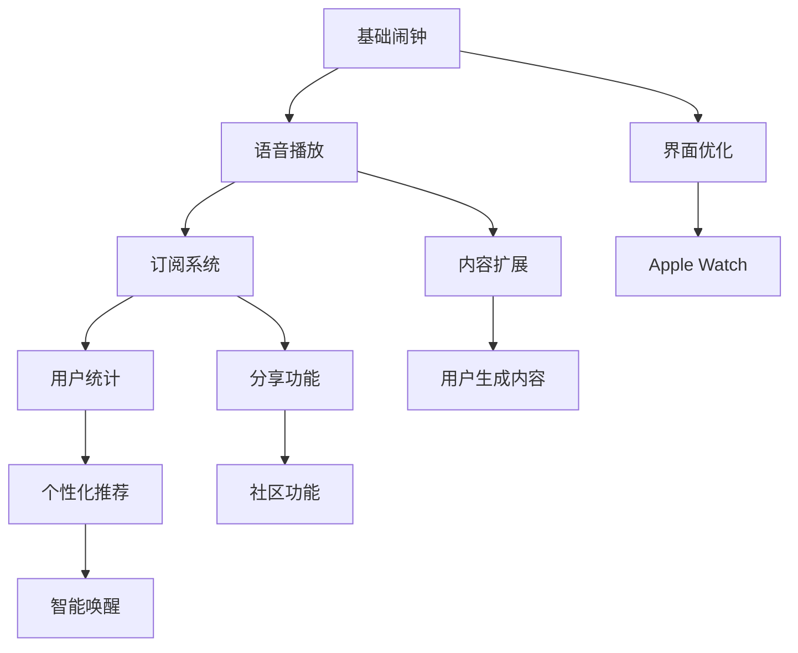
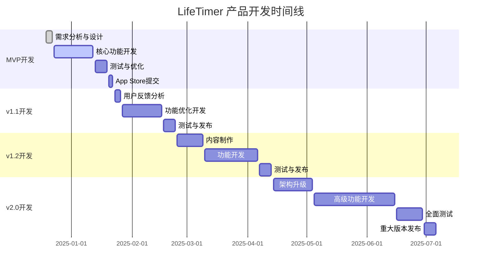

# LifeTimer 产品路线图 (Roadmap)

## 1. 路线图概述

### 1.1 产品发展战略
LifeTimer采用渐进式产品发展策略，从MVP验证核心价值主张开始，逐步扩展功能和用户群体。我们专注于打造最优质的励志唤醒体验，通过持续的内容优化和用户体验提升来建立竞争优势。

### 1.2 发展阶段规划
- **第一阶段(MVP)**: 验证核心概念，建立用户基础
- **第二阶段(成长期)**: 优化用户体验，扩大用户规模
- **第三阶段(成熟期)**: 功能完善，建立生态系统

### 1.3 核心原则
- **用户价值优先**: 每个功能都必须为用户创造明确价值
- **简约至上**: 保持产品的简洁性和专注性
- **质量第一**: 宁可功能少而精，不要多而杂
- **数据驱动**: 基于用户行为数据指导产品决策

## 2. 版本规划策略

### 2.1 版本命名规则
- **MVP版本**: v1.0.x (最小可行产品)
- **功能增强版本**: v1.x.0 (新功能添加)
- **优化版本**: v1.x.x (体验优化和问题修复)
- **重大更新版本**: v2.0.0+ (架构升级或重大功能变更)

### 2.2 发布周期
- **MVP发布**: 开发完成后立即发布
- **功能更新**: 每2-3个月一次重大功能更新
- **优化更新**: 每2-4周一次体验优化更新
- **紧急修复**: 发现严重问题后24-48小时内发布

### 2.3 版本质量标准
- 所有P0功能必须完整实现
- 崩溃率≤0.1%
- 核心功能测试覆盖率≥90%
- 通过App Store审核标准

## 3. 详细版本规划

### 3.1 MVP版本 (v1.0.0) - 核心价值验证

**发布时间**: 开发启动后4周
**开发周期**: 4周
**核心目标**: 验证励志语音闹钟的核心价值主张

#### 3.1.1 核心功能 (P0)
- ✅ **基础闹钟功能**
  - 时间设置(24小时制)
  - 重复模式(工作日、每日、自定义)
  - 音量调节
  - 闹钟开关控制
  
- ✅ **励志语音播放**
  - 5条免费励志语音内容(30秒/条)
  - 随机播放机制
  - 循环播放直到关闭
  - 本地音频文件存储

- ✅ **用户订阅系统**
  - 7天免费试用
  - 月度订阅(¥6/月)
  - 年度订阅(¥58/年)
  - 基础订阅状态管理

- ✅ **基础UI界面**
  - 闹钟列表页面
  - 闹钟设置页面
  - 闹钟响起页面
  - 订阅管理页面

#### 3.1.2 技术实现 (P0)
- iOS原生开发(Swift + SwiftUI)
- Core Data本地数据存储
- UserNotifications本地通知
- StoreKit应用内购买
- AVFoundation音频播放

#### 3.1.3 成功指标
- 完成基础功能开发和测试
- 通过App Store审核并成功上架
- 获得首批100个用户下载
- 用户能够成功设置和使用闹钟
- 付费转化率≥5%

### 3.2 优化版本 (v1.1.0) - 用户体验提升

**发布时间**: MVP发布后6周
**开发周期**: 4周
**核心目标**: 基于用户反馈优化体验，提升留存率

#### 3.2.1 功能优化 (P0)
- ✅ **语音内容扩展**
  - 增加到15条励志语音内容
  - 免费用户可使用8条内容
  - 语音内容分类(激励、目标、成功等主题)

- ✅ **用户体验优化**
  - 闹钟设置流程简化
  - 界面动画效果优化
  - 错误提示信息优化
  - 加载状态指示器

- ✅ **性能优化**
  - 应用启动速度优化
  - 内存使用优化
  - 电池消耗优化
  - 闹钟准确性提升

#### 3.2.2 新增功能 (P1)
- ✅ **使用统计**
  - 连续使用天数记录
  - 闹钟使用频率统计
  - 个人成就展示

- ✅ **设置优化**
  - 通知权限引导优化
  - 音效开关设置
  - 深色模式支持

#### 3.2.3 成功指标
- 7日用户留存率≥40%
- 应用启动时间≤2秒
- 用户满意度评分≥4.0
- 付费转化率≥10%

### 3.3 增长版本 (v1.2.0) - 用户规模扩大

**发布时间**: v1.1.0发布后8周
**开发周期**: 6周
**核心目标**: 扩大用户规模，提升市场影响力

#### 3.3.1 内容丰富 (P0)
- ✅ **完整语音库**
  - 30条完整励志语音内容
  - 多种语音风格(激情、温和、实用)
  - 专业配音师录制
  - 高质量音频处理

- ✅ **个性化体验**
  - 用户偏好设置
  - 语音播放历史记录
  - 智能推荐机制

#### 3.3.2 营销功能 (P1)
- ✅ **分享功能**
  - 成就分享到社交媒体
  - 邀请好友使用
  - 推荐奖励机制

- ✅ **用户反馈**
  - 应用内评价提醒
  - 意见反馈收集
  - 客服支持入口

#### 3.3.3 成功指标
- 月活跃用户数≥1000
- 30日用户留存率≥25%
- App Store评分≥4.5
- 付费转化率≥15%

### 3.4 完善版本 (v2.0.0) - 生态系统建立

**发布时间**: v1.2.0发布后12周
**开发周期**: 8周
**核心目标**: 建立完整的产品生态，实现可持续发展

#### 3.4.1 高级功能 (P0)
- ✅ **智能唤醒**
  - 睡眠周期检测
  - 最佳唤醒时间计算
  - 渐进式音量调节

- ✅ **内容生态**
  - 用户自定义语音上传
  - 社区优质内容推荐
  - 内容创作者激励计划

#### 3.4.2 平台扩展 (P1)
- ✅ **Apple Watch支持**
  - 手表端闹钟设置
  - 触觉反馈唤醒
  - 快捷操作支持

- ✅ **Siri集成**
  - 语音设置闹钟
  - 快捷指令支持
  - 智能建议

#### 3.4.3 成功指标
- 月活跃用户数≥5000
- 用户生命周期价值≥¥50
- 月度经常性收入≥¥50,000
- 市场领先地位确立

## 4. 功能优先级矩阵

### 4.1 优先级定义
- **P0 (必须有)**: 产品核心功能，缺失会影响基本使用
- **P1 (应该有)**: 重要功能，显著提升用户体验
- **P2 (可以有)**: 增值功能，在资源允许情况下实现
- **P3 (暂不考虑)**: 未来可能需要的功能

### 4.2 功能优先级矩阵

| 功能模块 | MVP(v1.0) | 优化版(v1.1) | 增长版(v1.2) | 完善版(v2.0) | 优先级 |
|----------|-----------|--------------|--------------|--------------|--------|
| 基础闹钟设置 | ✅ | 优化 | 完善 | 智能化 | P0 |
| 励志语音播放 | ✅ | 扩展 | 完整 | 个性化 | P0 |
| 订阅管理 | ✅ | 优化 | 完善 | 高级套餐 | P0 |
| 用户界面 | ✅ | 优化 | 美化 | 重设计 | P0 |
| 性能优化 | 基础 | ✅ | 持续 | 极致 | P0 |
| 使用统计 | - | ✅ | 完善 | 智能分析 | P1 |
| 分享功能 | - | - | ✅ | 社区化 | P1 |
| Apple Watch | - | - | - | ✅ | P1 |
| 多语言支持 | - | - | 考虑 | ✅ | P2 |
| 社交功能 | - | - | - | 考虑 | P2 |

### 4.3 功能依赖关系

## 5. 详细时间线计划

### 5.1 开发里程碑

### 5.2 关键里程碑节点

| 里程碑 | 时间节点 | 交付物 | 成功标准 |
|--------|----------|--------|----------|
| 需求确认 | 2024-12-22 | PRD、设计稿 | 团队一致认可 |
| MVP开发完成 | 2025-01-12 | 可运行的应用 | 核心功能正常 |
| App Store上架 | 2025-01-22 | 公开发布版本 | 通过审核上架 |
| 首批用户获取 | 2025-02-01 | 100+下载量 | 用户反馈收集 |
| v1.1发布 | 2025-02-23 | 优化版本 | 留存率提升 |
| 付费用户突破 | 2025-03-15 | 50+付费用户 | 商业模式验证 |
| v1.2发布 | 2025-04-13 | 完整版本 | 功能完善 |
| 用户规模突破 | 2025-05-31 | 1000+用户 | 市场认可 |
| v2.0发布 | 2025-07-06 | 重大升级 | 生态建立 |

### 5.3 风险缓解时间安排

| 风险类型 | 预防措施时间 | 应对措施时间 | 负责人 |
|----------|--------------|--------------|--------|
| 技术风险 | 开发前期 | 发现后24小时 | 技术负责人 |
| 市场风险 | MVP发布前 | 数据异常后1周 | 产品经理 |
| 竞争风险 | 持续监控 | 发现后2周 | 产品团队 |
| 政策风险 | 发布前审查 | 政策变化后1周 | 法务顾问 |

## 6. 资源规划

### 6.1 团队配置建议

#### 6.1.1 核心团队(MVP阶段)
- **产品经理** × 1: 产品规划、需求管理、项目协调
- **iOS开发工程师** × 2: 客户端开发、技术架构
- **UI/UX设计师** × 1: 界面设计、用户体验
- **测试工程师** × 1: 功能测试、性能测试
- **内容制作** × 1: 励志语音内容录制和制作

#### 6.1.2 扩展团队(成长阶段)
- **后端工程师** × 1: 数据分析、用户管理系统
- **运营专员** × 1: 用户运营、内容运营
- **数据分析师** × 1: 用户行为分析、商业智能

### 6.2 开发成本估算

#### 6.2.1 人力成本(月度)
| 角色 | 人数 | 月薪(万元) | MVP期间(4个月) | 总计(万元) |
|------|------|------------|----------------|------------|
| 产品经理 | 1 | 2.5 | 4个月 | 10.0 |
| iOS开发 | 2 | 3.0 | 4个月 | 24.0 |
| UI设计师 | 1 | 2.0 | 3个月 | 6.0 |
| 测试工程师 | 1 | 1.8 | 3个月 | 5.4 |
| 内容制作 | 1 | 1.5 | 2个月 | 3.0 |
| **小计** | - | - | - | **48.4** |

#### 6.2.2 其他成本
| 项目 | 费用(万元) | 说明 |
|------|------------|------|
| 开发者账号 | 0.07 | Apple Developer Program |
| 设计工具 | 0.5 | Figma、Adobe等订阅 |
| 测试设备 | 2.0 | 各型号iPhone测试机 |
| 音频制作 | 3.0 | 录音棚、配音师费用 |
| 法务咨询 | 1.0 | 用户协议、隐私政策 |
| 营销推广 | 5.0 | 初期推广费用 |
| **小计** | **11.57** | - |

#### 6.2.3 总成本预算
- **MVP阶段总成本**: 59.97万元
- **月度运营成本**: 8-12万元(成长期)
- **年度总投入预算**: 150-200万元

### 6.3 收入预测

#### 6.3.1 用户增长预测
| 时间节点 | 累计用户数 | 付费用户数 | 付费转化率 |
|----------|------------|------------|------------|
| MVP发布(1个月) | 100 | 5 | 5% |
| v1.1发布(3个月) | 500 | 50 | 10% |
| v1.2发布(6个月) | 2000 | 300 | 15% |
| v2.0发布(12个月) | 8000 | 1200 | 15% |

#### 6.3.2 收入预测
| 时间节点 | 月度订阅收入 | 年度订阅收入 | 总月收入 |
|----------|--------------|--------------|----------|
| 3个月 | ¥180 | ¥1,160 | ¥1,340 |
| 6个月 | ¥1,080 | ¥8,700 | ¥9,780 |
| 12个月 | ¥4,320 | ¥41,760 | ¥46,080 |
| 24个月 | ¥12,960 | ¥139,200 | ¥152,160 |

### 6.4 投资回报分析

#### 6.4.1 盈亏平衡点
- **预计盈亏平衡时间**: 第18个月
- **盈亏平衡用户数**: 约6000名用户(900名付费用户)
- **月度盈亏平衡收入**: ¥35,000

#### 6.4.2 ROI预测
- **24个月累计投入**: 约300万元
- **24个月累计收入**: 约180万元
- **预计3年ROI**: 150%+

## 7. 风险管理

### 7.1 技术风险

#### 7.1.1 主要技术风险
| 风险项 | 概率 | 影响程度 | 风险等级 |
|--------|------|----------|----------|
| iOS系统兼容性问题 | 中 | 高 | 高 |
| 音频播放稳定性 | 中 | 中 | 中 |
| 应用内购买集成问题 | 低 | 高 | 中 |
| 性能优化困难 | 中 | 中 | 中 |
| 数据存储问题 | 低 | 中 | 低 |

#### 7.1.2 技术风险应对策略
- **iOS兼容性**: 
  - 预防: 使用稳定的API，避免使用过新的特性
  - 应对: 建立完善的测试环境，覆盖主流iOS版本
  
- **音频播放**: 
  - 预防: 选择成熟的音频框架，进行充分测试
  - 应对: 准备备用播放方案，建立错误恢复机制
  
- **应用内购买**: 
  - 预防: 深入学习StoreKit文档，参考最佳实践
  - 应对: 建立完善的收据验证和错误处理机制

### 7.2 市场风险

#### 7.2.1 主要市场风险
| 风险项 | 概率 | 影响程度 | 风险等级 |
|--------|------|----------|----------|
| 用户接受度不高 | 中 | 高 | 高 |
| 竞争对手模仿 | 高 | 中 | 中 |
| 市场需求变化 | 低 | 高 | 中 |
| 付费意愿不足 | 中 | 高 | 高 |

#### 7.2.2 市场风险应对策略
- **用户接受度**: 
  - 预防: 充分的用户调研，MVP快速验证
  - 应对: 快速迭代优化，调整产品策略
  
- **竞争威胁**: 
  - 预防: 建立技术和内容壁垒，申请相关专利
  - 应对: 持续创新，提升用户粘性
  
- **付费转化**: 
  - 预防: 设计合理的免费试用机制
  - 应对: 优化定价策略，增加付费价值

### 7.3 运营风险

#### 7.3.1 主要运营风险
| 风险项 | 概率 | 影响程度 | 风险等级 |
|--------|------|----------|----------|
| 团队人员流失 | 中 | 高 | 高 |
| 资金链断裂 | 低 | 极高 | 中 |
| App Store政策变化 | 中 | 中 | 中 |
| 内容版权问题 | 低 | 高 | 中 |

#### 7.3.2 运营风险应对策略
- **人员管理**: 
  - 预防: 建立良好的团队文化，提供有竞争力的薪酬
  - 应对: 建立知识文档，培养备用人才
  
- **资金管理**: 
  - 预防: 制定详细的财务计划，寻找投资机会
  - 应对: 建立应急资金，调整开发节奏
  
- **政策合规**: 
  - 预防: 密切关注政策变化，确保合规运营
  - 应对: 快速调整产品策略，寻求法务支持

### 7.4 风险监控机制

#### 7.4.1 风险监控指标
- **技术指标**: 崩溃率、性能指标、用户反馈
- **市场指标**: 下载量、留存率、转化率、竞品动态
- **运营指标**: 团队稳定性、资金状况、合规状态

#### 7.4.2 风险响应流程
1. **风险识别**: 定期风险评估会议(每月)
2. **风险评估**: 评估概率和影响程度
3. **制定对策**: 制定预防和应对措施
4. **执行监控**: 持续监控风险指标
5. **应急响应**: 风险发生时的快速响应机制

---

**文档状态**: 已完成
**负责人**: 产品经理
**更新频率**: 每月更新一次，重大变化时及时更新
**相关文档**: PRD.md, User_Story_Map.md, Metrics_Framework.md