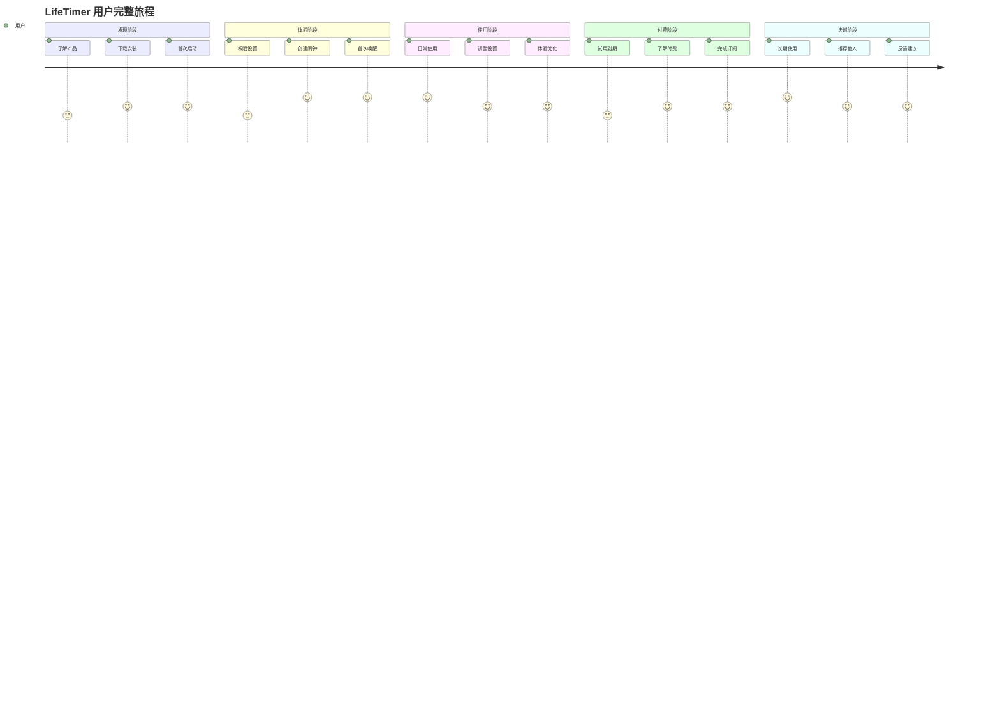

# LifeTimer 用户故事地图 (User Story Map)

## 1. 用户故事地图概述

### 1.1 用户故事地图的目的
用户故事地图是一种可视化工具，帮助我们从用户角度理解LifeTimer的完整使用流程。通过横向的用户活动流和纵向的任务分解，我们能够：
- 全面理解用户的使用旅程
- 识别关键的用户需求和痛点
- 合理规划功能优先级和版本迭代
- 确保产品开发始终以用户价值为中心

### 1.2 目标用户群体
- **主要用户**: 18-35岁的学生和职场人士
- **核心需求**: 规律作息、积极心态、个人成长
- **使用场景**: 工作日早起、重要日程前的准备

### 1.3 用户故事地图结构说明
- **横向(用户活动流)**: 用户使用产品的完整时间线
- **纵向(任务分解)**: 每个活动下的具体任务，按优先级排列
- **版本映射**: 不同任务对应的产品版本规划

## 2. 用户活动流 (横向)

### 2.1 完整用户旅程概览

### 2.2 核心活动阶段定义

| 阶段 | 活动名称 | 用户目标 | 关键成功指标 |
|------|----------|----------|--------------|
| 1 | 产品发现 | 找到解决起床问题的方案 | 应用下载量 |
| 2 | 初次体验 | 快速上手并体验核心价值 | 首次设置成功率 |
| 3 | 日常使用 | 养成使用习惯，获得价值 | 7日留存率 |
| 4 | 付费决策 | 决定是否为产品付费 | 付费转化率 |
| 5 | 深度使用 | 长期使用并获得持续价值 | 30日留存率 |
| 6 | 价值传播 | 向他人推荐产品 | 推荐转化率 |

## 3. 用户任务分解 (纵向)

### 3.1 阶段1: 产品发现与下载

#### 3.1.1 用户活动: 了解产品
**用户目标**: 了解LifeTimer能否解决我的起床问题

| 优先级 | 用户故事 | 验收标准 | 版本 |
|--------|----------|----------|------|
| P0 | 作为潜在用户，我想要在App Store看到清晰的产品介绍，以便了解产品价值 | App Store页面信息完整准确 | MVP |
| P1 | 作为潜在用户，我想要看到真实的用户评价，以便判断产品质量 | 获得4.0+星评价 | v1.1 |
| P2 | 作为潜在用户，我想要看到产品演示视频，以便更直观地了解功能 | 制作产品演示视频 | v1.2 |

#### 3.1.2 用户活动: 下载安装
**用户目标**: 顺利下载并安装应用

| 优先级 | 用户故事 | 验收标准 | 版本 |
|--------|----------|----------|------|
| P0 | 作为用户，我想要快速下载应用，以便尽快开始使用 | 应用包大小≤100MB | MVP |
| P0 | 作为用户，我想要应用能在我的设备上正常安装，以便正常使用 | 支持iOS 14.0+设备 | MVP |

### 3.2 阶段2: 初次体验

#### 3.2.1 用户活动: 应用启动与引导
**用户目标**: 快速了解应用功能并完成基础设置

| 优先级 | 用户故事 | 验收标准 | 版本 |
|--------|----------|----------|------|
| P0 | 作为新用户，我想要应用快速启动，以便不浪费时间等待 | 启动时间≤2秒 | MVP |
| P1 | 作为新用户，我想要简洁的功能介绍，以便快速了解如何使用 | 3步内完成引导 | v1.1 |
| P1 | 作为新用户，我想要跳过复杂的注册流程，以便立即开始使用 | 无需注册即可使用 | MVP |

#### 3.2.2 用户活动: 权限设置
**用户目标**: 授予必要权限以确保功能正常工作

| 优先级 | 用户故事 | 验收标准 | 版本 |
|--------|----------|----------|------|
| P0 | 作为用户，我想要了解为什么需要通知权限，以便放心授权 | 权限说明清晰易懂 | MVP |
| P0 | 作为用户，我想要在拒绝权限后能重新设置，以便正常使用功能 | 提供权限设置入口 | MVP |
| P1 | 作为用户，我想要权限申请流程简单，以便快速完成设置 | 一键授权流程 | v1.1 |

#### 3.2.3 用户活动: 创建第一个闹钟
**用户目标**: 成功设置第一个励志语音闹钟

| 优先级 | 用户故事 | 验收标准 | 版本 |
|--------|----------|----------|------|
| P0 | 作为新用户，我想要简单地设置闹钟时间，以便快速完成设置 | 使用系统时间选择器 | MVP |
| P0 | 作为新用户，我想要选择工作日重复，以便满足日常需求 | 提供工作日快捷选项 | MVP |
| P0 | 作为新用户，我想要预览励志语音，以便了解唤醒体验 | 提供语音试听功能 | MVP |
| P1 | 作为新用户，我想要获得设置建议，以便做出最佳选择 | 提供推荐设置选项 | v1.1 |

### 3.3 阶段3: 日常使用

#### 3.3.1 用户活动: 被闹钟唤醒
**用户目标**: 获得积极的起床体验

| 优先级 | 用户故事 | 验收标准 | 版本 |
|--------|----------|----------|------|
| P0 | 作为用户，我想要闹钟准时响起，以便按时起床 | 闹钟准确率≥99.9% | MVP |
| P0 | 作为用户，我想要听到励志语音内容，以便获得积极心态 | 语音清晰播放 | MVP |
| P0 | 作为用户，我想要轻松关闭闹钟，以便停止响铃 | 大号关闭按钮 | MVP |
| P1 | 作为用户，我想要每天听到不同的内容，以便保持新鲜感 | 随机播放机制 | MVP |
| P1 | 作为用户，我想要看到当前播放的内容信息，以便了解内容 | 显示语音标题 | v1.1 |

#### 3.3.2 用户活动: 管理闹钟
**用户目标**: 根据需要调整闹钟设置

| 优先级 | 用户故事 | 验收标准 | 版本 |
|--------|----------|----------|------|
| P0 | 作为用户，我想要查看所有闹钟，以便管理我的设置 | 闹钟列表清晰显示 | MVP |
| P0 | 作为用户，我想要快速开关闹钟，以便临时调整 | 一键开关功能 | MVP |
| P0 | 作为用户，我想要编辑闹钟时间，以便适应时间变化 | 编辑功能正常 | MVP |
| P1 | 作为用户，我想要复制闹钟设置，以便快速创建相似闹钟 | 复制功能 | v1.2 |
| P1 | 作为用户，我想要批量管理闹钟，以便提高效率 | 批量操作功能 | v1.2 |

#### 3.3.3 用户活动: 个性化设置
**用户目标**: 根据个人偏好调整应用设置

| 优先级 | 用户故事 | 验收标准 | 版本 |
|--------|----------|----------|------|
| P1 | 作为用户，我想要调整音量大小，以便适应不同环境 | 音量调节功能 | MVP |
| P1 | 作为用户，我想要选择语音类型，以便获得偏好体验 | 语音分类选择 | v1.1 |
| P2 | 作为用户，我想要设置渐进音量，以便温和唤醒 | 渐进音量功能 | v2.0 |
| P2 | 作为用户，我想要自定义唤醒时长，以便控制体验 | 时长设置选项 | v2.0 |

### 3.4 阶段4: 付费决策

#### 3.4.1 用户活动: 了解付费价值
**用户目标**: 理解付费版本的价值和权益

| 优先级 | 用户故事 | 验收标准 | 版本 |
|--------|----------|----------|------|
| P0 | 作为试用用户，我想要了解付费版有什么额外内容，以便做出决策 | 权益对比清晰展示 | MVP |
| P0 | 作为试用用户，我想要知道试用期还剩多少时间，以便合理安排 | 试用期倒计时显示 | MVP |
| P1 | 作为试用用户，我想要体验部分付费内容，以便评估价值 | 提供付费内容预览 | v1.1 |
| P1 | 作为用户，我想要看到其他用户的付费反馈，以便参考决策 | 用户评价展示 | v1.2 |

#### 3.4.2 用户活动: 完成订阅购买
**用户目标**: 顺利完成付费订阅流程

| 优先级 | 用户故事 | 验收标准 | 版本 |
|--------|----------|----------|------|
| P0 | 作为用户，我想要看到清晰的价格信息，以便了解费用 | 价格显示准确清晰 | MVP |
| P0 | 作为用户，我想要安全地完成支付，以便保护个人信息 | 使用系统支付框架 | MVP |
| P0 | 作为用户，我想要立即享受付费权益，以便获得价值 | 订阅状态实时更新 | MVP |
| P1 | 作为用户，我想要灵活的订阅选项，以便选择合适方案 | 提供月度/年度选项 | MVP |
| P1 | 作为用户，我想要了解取消政策，以便放心订阅 | 取消政策说明清晰 | v1.1 |

### 3.5 阶段5: 深度使用

#### 3.5.1 用户活动: 长期使用习惯养成
**用户目标**: 将LifeTimer融入日常生活习惯

| 优先级 | 用户故事 | 验收标准 | 版本 |
|--------|----------|----------|------|
| P1 | 作为长期用户，我想要看到使用统计，以便了解自己的进步 | 使用天数统计 | v1.1 |
| P1 | 作为长期用户，我想要获得成就奖励，以便保持动力 | 成就系统 | v1.2 |
| P2 | 作为长期用户，我想要个性化推荐，以便获得更好体验 | 智能推荐算法 | v2.0 |
| P2 | 作为长期用户，我想要数据分析报告，以便了解习惯变化 | 数据分析功能 | v2.0 |

#### 3.5.2 用户活动: 探索高级功能
**用户目标**: 使用更多高级功能提升体验

| 优先级 | 用户故事 | 验收标准 | 版本 |
|--------|----------|----------|------|
| P2 | 作为高级用户，我想要智能唤醒功能，以便在最佳时间起床 | 睡眠周期检测 | v2.0 |
| P2 | 作为高级用户，我想要自定义语音内容，以便个性化体验 | 用户上传功能 | v2.0 |
| P2 | 作为高级用户，我想要Apple Watch支持，以便更好的体验 | Watch应用开发 | v2.0 |

### 3.6 阶段6: 价值传播

#### 3.6.1 用户活动: 分享推荐
**用户目标**: 向他人推荐这款优秀的产品

| 优先级 | 用户故事 | 验收标准 | 版本 |
|--------|----------|----------|------|
| P1 | 作为满意用户，我想要分享我的使用成果，以便激励他人 | 成就分享功能 | v1.2 |
| P1 | 作为满意用户，我想要邀请朋友使用，以便一起进步 | 邀请功能 | v1.2 |
| P2 | 作为满意用户，我想要获得推荐奖励，以便获得额外价值 | 推荐奖励机制 | v1.2 |

#### 3.6.2 用户活动: 反馈建议
**用户目标**: 帮助产品变得更好

| 优先级 | 用户故事 | 验收标准 | 版本 |
|--------|----------|----------|------|
| P1 | 作为用户，我想要给应用评分，以便帮助其他用户 | 评分提醒功能 | v1.1 |
| P1 | 作为用户，我想要提供使用反馈，以便帮助产品改进 | 反馈收集功能 | v1.1 |
| P2 | 作为用户，我想要参与产品讨论，以便影响产品方向 | 社区功能 | v2.0+ |

## 4. 故事优先级与版本映射

### 4.1 MVP版本 (v1.0.0) - 核心价值验证

#### 4.1.1 必须实现的用户故事 (P0)
- ✅ 快速应用启动 (≤2秒)
- ✅ 简单的闹钟时间设置
- ✅ 工作日重复模式选择
- ✅ 励志语音播放和试听
- ✅ 闹钟准时响起 (≥99.9%准确率)
- ✅ 轻松关闭闹钟
- ✅ 随机语音播放机制
- ✅ 闹钟列表管理
- ✅ 快速开关闹钟
- ✅ 编辑闹钟功能
- ✅ 音量调节功能
- ✅ 清晰的付费权益说明
- ✅ 试用期倒计时显示
- ✅ 安全的订阅购买流程
- ✅ 灵活的订阅选项

**成功标准**:
- 用户能够在5分钟内完成首次闹钟设置
- 闹钟功能稳定可靠，准确率≥99.9%
- 付费转化率≥5%

### 4.2 优化版本 (v1.1.0) - 体验提升

#### 4.2.1 重要功能 (P1)
- ✅ 简洁的功能引导 (3步内完成)
- ✅ 一键权限授权流程
- ✅ 设置建议和推荐选项
- ✅ 语音标题和信息显示
- ✅ 语音分类选择
- ✅ 付费内容预览体验
- ✅ 取消政策说明
- ✅ 使用天数统计
- ✅ 应用评分提醒
- ✅ 用户反馈收集

**成功标准**:
- 7日用户留存率≥40%
- 用户满意度评分≥4.0
- 付费转化率≥10%

### 4.3 增长版本 (v1.2.0) - 规模扩大

#### 4.3.1 增值功能 (P1-P2)
- ✅ 产品演示视频
- ✅ 闹钟复制功能
- ✅ 批量管理功能
- ✅ 用户评价展示
- ✅ 成就系统
- ✅ 成就分享功能
- ✅ 邀请朋友功能
- ✅ 推荐奖励机制

**成功标准**:
- 月活跃用户数≥1000
- 30日用户留存率≥25%
- 付费转化率≥15%

### 4.4 完善版本 (v2.0.0) - 生态建立

#### 4.4.1 高级功能 (P2)
- ✅ 渐进音量唤醒
- ✅ 自定义唤醒时长
- ✅ 个性化推荐算法
- ✅ 数据分析报告
- ✅ 智能唤醒 (睡眠周期检测)
- ✅ 用户自定义语音上传
- ✅ Apple Watch支持
- ✅ 社区功能

**成功标准**:
- 月活跃用户数≥5000
- 用户生命周期价值≥¥50
- 建立行业领先地位

## 5. 用户故事验收标准

### 5.1 功能性验收标准

#### 5.1.1 闹钟核心功能
| 用户故事 | 验收标准 | 测试方法 |
|----------|----------|----------|
| 设置闹钟时间 | 能够准确设置24小时制时间 | 功能测试 |
| 选择重复模式 | 支持工作日、每日、自定义模式 | 功能测试 |
| 闹钟准时响起 | 误差≤30秒，成功率≥99.9% | 长期稳定性测试 |
| 语音播放 | 音质清晰，无卡顿现象 | 音频质量测试 |
| 随机播放 | 连续使用不重复概率≥80% | 随机性测试 |

#### 5.1.2 用户体验功能
| 用户故事 | 验收标准 | 测试方法 |
|----------|----------|----------|
| 应用启动 | 冷启动时间≤2秒 | 性能测试 |
| 界面响应 | 操作响应时间≤0.5秒 | 交互测试 |
| 权限申请 | 权限说明清晰，流程简单 | 用户体验测试 |
| 错误处理 | 错误信息友好，提供解决方案 | 异常测试 |

### 5.2 可用性验收标准

#### 5.2.1 易用性标准
- 新用户5分钟内完成首次设置
- 核心功能3步内完成操作
- 界面元素符合iOS设计规范
- 支持VoiceOver无障碍功能

#### 5.2.2 兼容性标准
- 支持iOS 14.0+系统版本
- 适配iPhone 6s及以上机型
- 支持横竖屏自适应
- 支持系统深色模式

### 5.3 性能验收标准

#### 5.3.1 响应时间标准
- 应用启动: ≤2秒
- 页面切换: ≤0.5秒
- 闹钟设置保存: ≤1秒
- 语音播放启动: ≤0.3秒

#### 5.3.2 资源使用标准
- 内存使用: ≤50MB
- 应用包大小: ≤100MB
- CPU使用率: 正常使用≤5%
- 电池消耗: 最小化后台活动

## 6. 用户故事优先级决策框架

### 6.1 优先级评估维度

#### 6.1.1 用户价值维度
- **高价值**: 直接解决核心痛点，用户强烈需要
- **中价值**: 提升用户体验，用户比较需要
- **低价值**: 锦上添花功能，用户可有可无

#### 6.1.2 商业价值维度
- **高价值**: 直接影响付费转化或用户留存
- **中价值**: 间接影响商业指标
- **低价值**: 对商业指标影响较小

#### 6.1.3 实现复杂度维度
- **低复杂度**: 1-3天可完成
- **中复杂度**: 1-2周可完成
- **高复杂度**: 2周以上完成

### 6.2 优先级决策矩阵

| 用户价值 | 商业价值 | 实现复杂度 | 优先级 | 版本安排 |
|----------|----------|------------|--------|----------|
| 高 | 高 | 低 | P0 | MVP |
| 高 | 高 | 中 | P0 | MVP |
| 高 | 中 | 低 | P0 | MVP |
| 中 | 高 | 低 | P1 | v1.1 |
| 高 | 低 | 低 | P1 | v1.1 |
| 中 | 中 | 低 | P1 | v1.1 |
| 高 | 高 | 高 | P1 | v1.2 |
| 低 | 高 | 低 | P2 | v1.2 |
| 中 | 低 | 中 | P2 | v2.0 |
| 低 | 低 | 任意 | P3 | 暂不考虑 |

### 6.3 优先级调整机制

#### 6.3.1 数据驱动调整
- 基于用户行为数据调整功能优先级
- 根据用户反馈重新评估需求价值
- 参考竞品动态调整策略重点

#### 6.3.2 定期评审机制
- 每月进行一次优先级评审
- 重大市场变化时及时调整
- 新用户故事按框架评估优先级

---

**文档状态**: 已完成
**维护责任**: 产品经理
**更新频率**: 每月更新，重大变化时及时调整
**相关文档**: PRD.md, Roadmap.md, Metrics_Framework.md